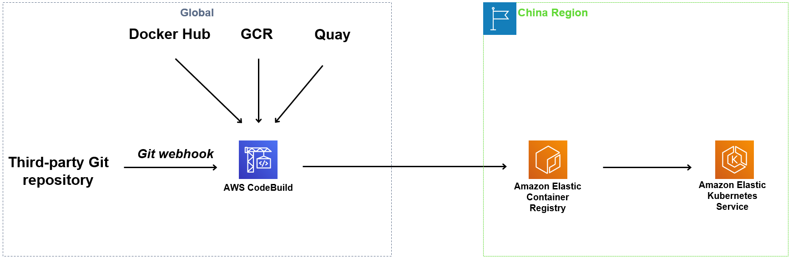

## 声明
您理解并同意：本镜像站收集并供您下载的镜像文件是按“原样”提供的，即我们无法控制或修改镜像文件，可能会出现由于开发者未及时更新或该镜像文件本身存在异常导致该镜像文件损坏或其他不可用状态，我们也不提供有关文件（内容）的任何保证，不会对镜像文件及其相关的信息或文档的可用性、可靠性、正确性或更新、升级等提供任何明示或默示的承诺或保证，镜像文件的下载和使用完全由您自主决定并自行承担风险，由此带来的任何损失，您同意在法律允许的范围内放弃追究我们的责任。


## 项目介绍
本项目用于将[Docker Hub](https://hub.docker.com/)，[Google Container Registry](https://console.cloud.google.com/gcr/images/google-containers/GLOBAL?pli=1)和[Quay](https://quay.io/search)中常用的公共container image自动同步至AWS中国区的ECR内，使AWS用户能更方便快捷的获取这些常见的容器镜像。  
如果您是container image的权利人，不允许相关container image同步到AWS中国区的ECR内，请发送邮件到nwcd_labs@nwcdcloud.cn。  


## Amazon ECR镜像路径
所有同步至ECR的镜像都放在048912060910.dkr.ecr.cn-northwest-1.amazonaws.com.cn这一container registry内，ECR镜像路径规则如下
* **Docker Hub** (*目前只支持[docker official images](https://github.com/docker-library/official-images)*)
    * 原始镜像路径: [library/]repo:tag
    * ECR镜像路径: 048912060910.dkr.ecr.cn-northwest-1.amazonaws.com.cn/dockerhub/[library/]repo:tag
* **GCR**
    * 原始镜像路径: gcr.io/namespace/repo:tag
    * ECR镜像路径: 048912060910.dkr.ecr.cn-northwest-1.amazonaws.com.cn/gcr/namespace/repo:tag
    * 原始镜像路径: k8s.gcr.io/repo:tag
    * ECR镜像路径: 048912060910.dkr.ecr.cn-northwest-1.amazonaws.com.cn/gcr/google_containers/repo:tag
* **Quay**
    * 原始镜像路径: quay.io/namespace/repo:tag
    * ECR镜像路径: 048912060910.dkr.ecr.cn-northwest-1.amazonaws.com.cn/quay/namespace/repo:tag
* **Global ECR**
    * 原始镜像路径: 602401143452.dkr.ecr.us-west-2.amazonaws.com/repo:tag
    * ECR镜像路径: 048912060910.dkr.ecr.cn-northwest-1.amazonaws.com.cn/amazonecr/repo:tag 

海外镜像复制到ECR后的路径转换示例如下：

| 海外镜像         | ECR镜像  |
|------------    |---------|
| nginx:1.17.9  | 048912060910.dkr.ecr.cn-northwest-1.amazonaws.com.cn/dockerhub/nginx:1.17.9 |
| gcr.io/heptio-images/velero:v1.1.0 | 048912060910.dkr.ecr.cn-northwest-1.amazonaws.com.cn/gcr/heptio-images/velero:v1.1.0 |
| k8s.gcr.io/cluster-autoscaler:v1.2.2 | 048912060910.dkr.ecr.cn-northwest-1.amazonaws.com.cn/gcr/google_containers/cluster-autoscaler:v1.2.2 |
| quay.io/calico/node:v3.7.4 | 048912060910.dkr.ecr.cn-northwest-1.amazonaws.com.cn/quay/calico/node:v3.7.4 |
| 602401143452.dkr.ecr.us-west-2.amazonaws.com/amazon-k8s-cni:v1.5.5 | 048912060910.dkr.ecr.cn-northwest-1.amazonaws.com.cn/amazonecr/amazon-k8s-cni:v1.5.5 |

## 使用方法
[使用方法帮助文档](docs/container-mirror-usage-guide.md)

1. 直接修改 kubernetes deployment yaml 文件中的 image 指向本项目 ECR 中相应镜像的路径。
2. 不方便修改 image 路径，或者想自动替换所有 Kubernetes Pod 中 image 到相应 ECR 路径，可以使用Kubernetes的[Mutating admission webhook](webhook/README.md) 实现自动替换。[点击查看示例](webhook/README.md)
3. 利用 Helm Charts 部署应用，并且chart template支持自定义Pod image，可以设置 chart 参数，指向本项目 ECR 中相应镜像的路径。[点击查看示例](docs/helm-chart-useage-guide.md)
4. 如果您的 kubernetes 集群直接使用 kubectl 部署，且kubectl版本在v1.14或以上，可以使用[kustomize](kustomize/README.md) 将原始 image 路径指向指向本项目 ECR 中相应镜像的路径。[点击查看示例](kustomize/README.md)
5. 直接 修改 ECS/Fargate 的 task defition yaml 文件，用于部署 ECS/Fargate Service和Task。[点击查看示例](docs/ecs-fargate-useage-guide.md)
6. Docker 和 docker-compose, 直接修改文件中的 image 指向本项目 ECR 中相应镜像的路径。[点击查看示例](docs/docker-docker-compose-usage-guide.md)

## 增加新的容器镜像
已有镜像列表放在[mirrored-images.txt](./mirror/mirrored-images.txt)。 
如果您需要其他镜像, 请您编辑 [required-images.txt](./mirror/required-images.txt) ，这将会在您的GitHub账户中 fork 一个新的分支，之后您可以提交PR（pull request）。 
后台管理员 Merge 您的PR会触发`CodeBuild` 去拉取 `required-images.txt` 中定义的镜像回 ECR库，拉取过程中，图标会变成`in progress`。 拉取完后，您可以看到图标从`in progress`变为`passing`


详细说明请参考[增加新的容器镜像帮助文档](docs/how-to-request-new-container-image.md)

## 自动同步新镜像
在[required-images-daily.txt](./mirror/required-images-daily.txt)中的镜像，会自动同步指定image的新镜像，tag中包含alpha、beta的不同步。目前仅支持Docker Hub。  

## ECR登录/docker login
EKS、Kops on EC2用户可直接使用，无需 ECR登录/docker login。
对于docker用户，需要 ECR 登录/docker login 后才能使用。

1. 确定你执行命令的 IAM user / IAM role 拥有下面权限：
```json
[
    "ecr:GetDownloadUrlForLayer",
    "ecr:BatchGetImage",
    "ecr:GetAuthorizationToken",
    "ecr:BatchCheckLayerAvailability"
]
```

2. 对于docker用户，执行 ECR 登录/docker login：
```bash
pip install awscli --upgrade --user
aws ecr get-login-password --region cn-northwest-1 | docker login --username AWS --password-stdin 048912060910.dkr.ecr.cn-northwest-1.amazonaws.com.cn
```

如果AWS CLI版本低于v1.17.10，需运行以下脚本：
```bash
aws ecr get-login --region cn-northwest-1 --registry-ids 048912060910 --no-include-email | sh
```

您也可以使用[ecr-credential-helper](https://github.com/awslabs/amazon-ecr-credential-helper) 完成登录。
