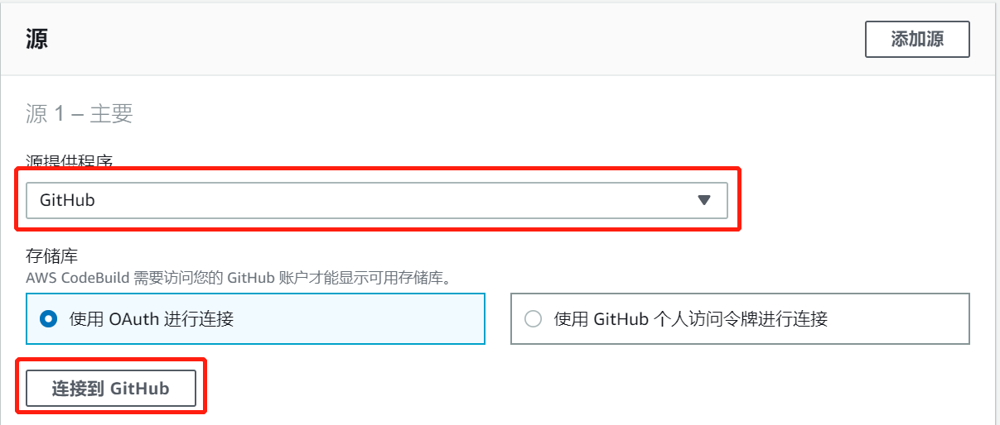

## 免责说明
建议测试过程中使用此方案，生产环境使用请自行考虑评估。  
欢迎联系参与方案共建和提交方案需求, 也欢迎在 github 项目issue中留言反馈bugs。    

## 介绍
本文介绍参考本项目进行自建镜像库。

## 前提条件
需要AWS China区域和AWS global区域账号。  
AWS global环境用于拉取容器镜像，然后推送到国内ECR。

# 自建镜像库
## 步骤1-Fork本项目
登录GitHub后，Fork本项目。
## 步骤2-修改ECR推送地址
在fork后的项目中，打开[mirror/mirror-base.sh](../mirror/mirror-base.sh)，修改第4、5行，修改ECR_REGION和ECR_DN为自己的地址。
## 步骤3-生成AWS China区域访问密钥
如果已有访问密钥 ID(Access key ID)和私有访问密钥(Secret access key)可跳过本步骤。  
登录AWS **China**后，访问[https://console.amazonaws.cn/iam/home?region=cn-northwest-1#/users$new?step=details](https://console.amazonaws.cn/iam/home?region=cn-northwest-1#/users$new?step=details)，用户名输入**ECR**，访问类型选中**编程访问**。点击**下一步:权限**，设置权限选择**直接附加现有策略**，筛选策略输入**AmazonEC2ContainerRegistryFullAccess**，然后在筛选出来的结果中，选中该策略前的复选框，点击**下一步:标签**，点击**下一步:审核**，点击**创建用户**，记录下**访问密钥 ID**和**私有访问密钥**。
## 步骤4-GitHub授权
登录AWS **Global**后，新建CodeBuild项目，直接点击连接：[https://ap-northeast-1.console.aws.amazon.com/codesuite/codebuild/project/new?region=ap-northeast-1](https://ap-northeast-1.console.aws.amazon.com/codesuite/codebuild/project/new?region=ap-northeast-1)，根据自己情况，可切换region。向下滚动到**源**，**源提供程序**选择**GitHub**，然后点击**连接到GitHub**，在弹出的页面中点击**Authorize aws-codesuite**进行授权。授权完毕后，不用再继续操作，步骤4会自动构建CodeBuild项目。

## 步骤5-部署CodeBuild
在AWS **Global**打开CloudFormation，**创建堆栈**，**上传模板文件**，文件为[CodeBuild.yaml](CodeBuild.yaml)。过程中需要输入3个参数，分别是步骤2生成的**访问密钥 ID**(AWSChinaAK)、**私有访问密钥**(AWSChinaSK)和您Fork的地址(RepositoryURL)。然后等待创建。
## 步骤6-验证
在[required-images.txt](../mirror/required-images.txt)添加一个需要镜像的地址，push到GitHub后，CodeBuild会自动启动构建，点击项目，查看**构建历史记录**，可查看具体构建版本的日志。