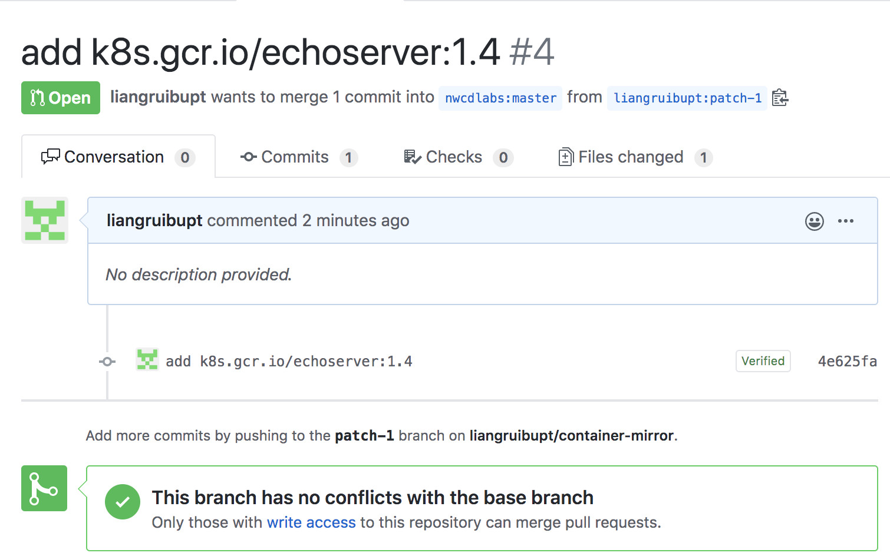
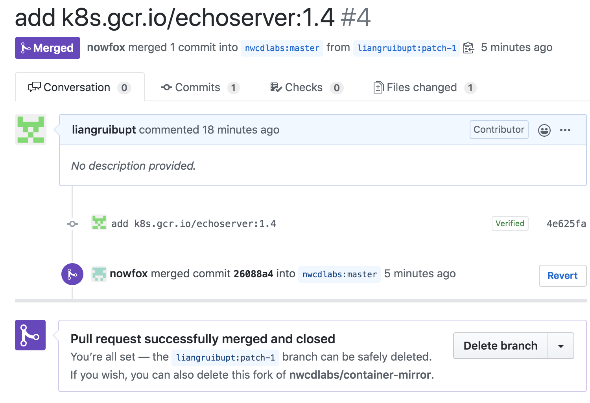
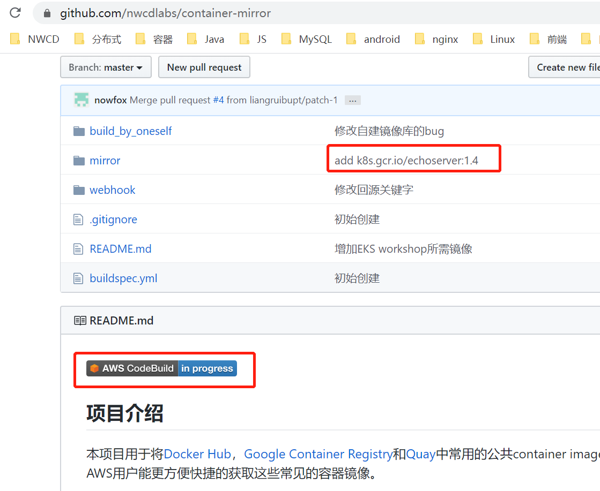
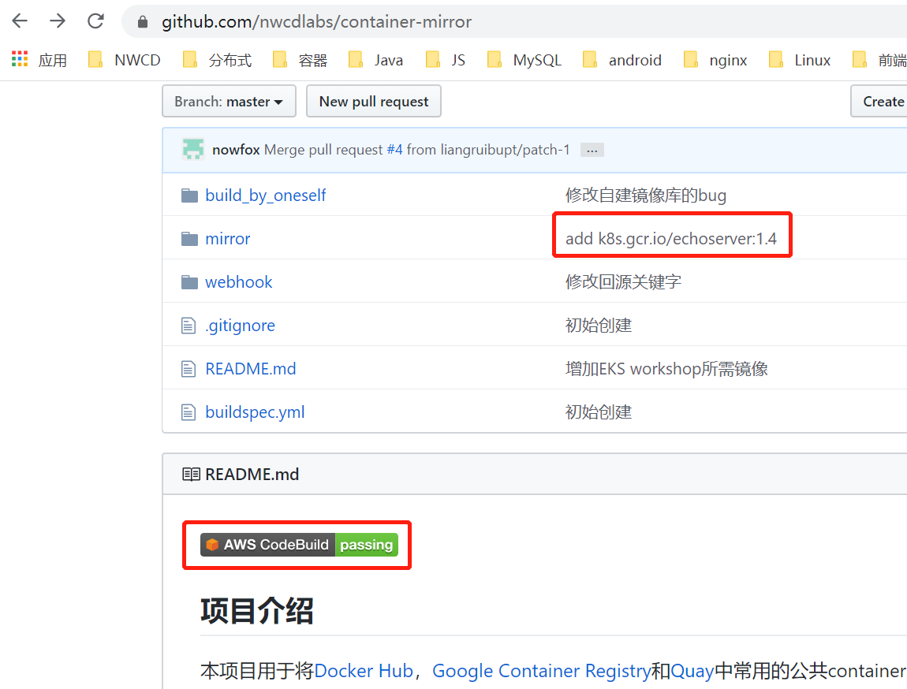

# 如何增加新的容器镜像

## 首先请查看已有镜像列表[mirrored-images.txt](../mirror/mirrored-images.txt)。 

## 如果您需要其他镜像, 请您编辑 [required-images.txt](../mirror/required-images.txt) ，这将会在您的GitHub账户中 fork 一个新的分支，之后您可以提交 PR（pull request）。 

## 后台管理员 Merge 您的PR会触发 `CodeBuild` 去拉取 `required-images.txt` 中定义的镜像回ECR库。 

## 拉取过程中，图标会变成`in progress`

## 拉取完后，您可以看到图标从`in progress`变为`passing`

